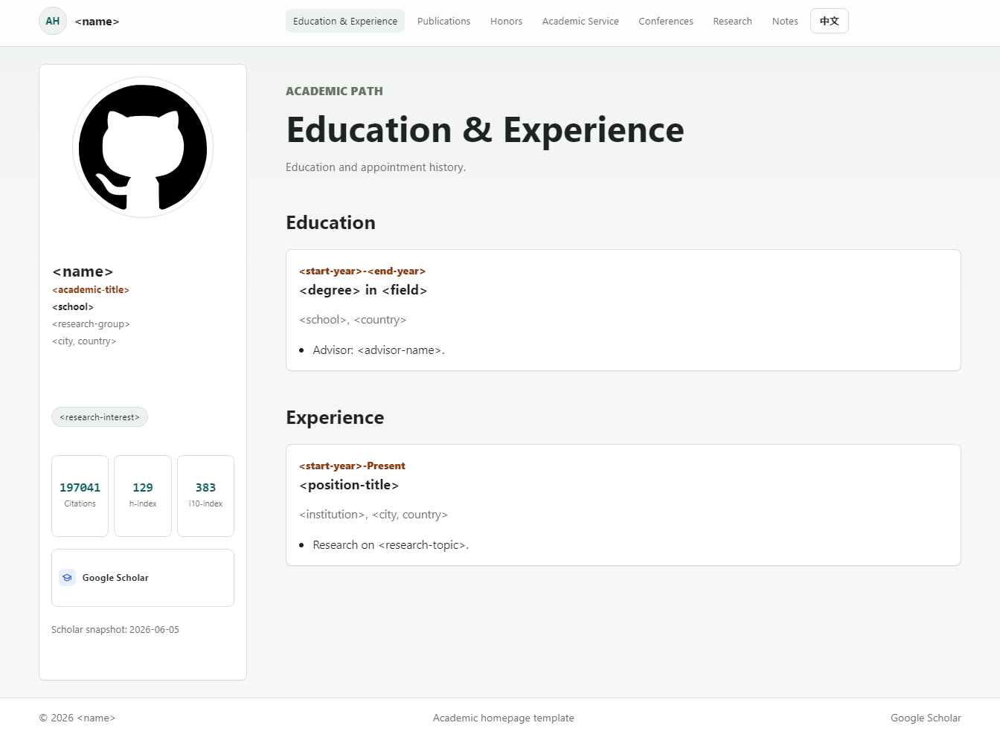
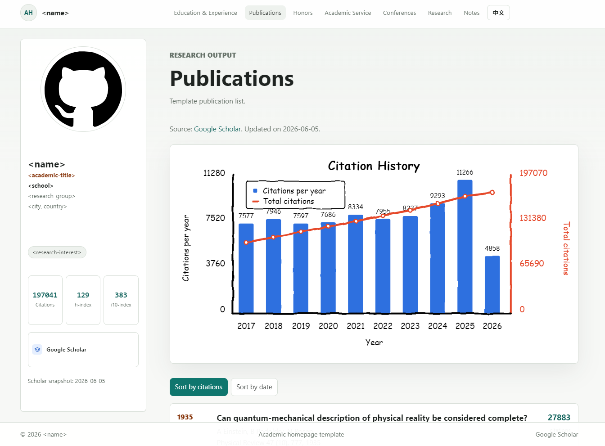

# Academic Homepage Template

A bilingual Jekyll template for academic personal homepages. It is designed to be edited from a few YAML files, refreshed from Google Scholar when needed, and published as a GitHub Pages site.

## Preview





## What This Template Includes

- English and Chinese pages.
- A fixed profile sidebar with avatar, links, research interests, and Scholar metrics.
- Pages for publications, education, experience, honors, service, conferences, patents, and essays.
- A Google Scholar refresh script with a default limit of 20 publications.
- A citation history chart that shows the latest 10 years by default.
- Placeholder content such as `<name>`, `<school>`, and `<research-interest>` so the template can be reused safely.

## First-Time Setup

Install Ruby, Bundler, and Python first. Then install the Jekyll dependencies:

```powershell
bundle install
```

After that, Windows users can usually start the site by double-clicking `run_server.bat`.

## Double-Click On Windows

The easiest local workflow is:

```text
Double-click run_server.bat
```

That `.bat` file does four things:

1. Switches into the project folder.
2. Adds `C:\Ruby33-x64\bin` to `PATH` if Ruby is installed there.
3. Runs the Google Scholar refresh in fast mode:

```powershell
python scripts/update_scholar.py --skip-links --limit 20
```

4. Starts the local Jekyll preview:

```powershell
bundle exec jekyll serve --host 127.0.0.1 --port 4000 --livereload
```

Then open:

```text
http://127.0.0.1:4000/
```

If Scholar blocks the request, the existing `_data` files are kept and the preview still starts. Close the terminal window or press `Ctrl+C` to stop the server.

`run_server.ps1` provides the same workflow for PowerShell. `update_and_preview.bat` also refreshes Scholar data, starts Jekyll, and opens the preview URL automatically.

## Updating Google Scholar Data

The default profile is Albert Einstein's public Google Scholar profile, used as a safe example:

```text
https://scholar.google.com/citations?user=qc6CJjYAAAAJ
```

To use your own profile, copy the `user` value from your Scholar URL and run:

```powershell
python scripts/update_scholar.py --user-id <scholar_user_id> --limit 20 --skip-links
```

You can also set an environment variable before double-clicking the launch script:

```powershell
$env:SCHOLAR_USER_ID = "<scholar_user_id>"
```

The refresh script updates:

- `_data/publications.yml`
- `_data/citation_history.yml`
- Scholar metrics in `_data/profile.yml`

Use `--skip-links` for the most reliable update. Without it, the script also tries to visit individual Scholar detail pages to find original article links, which is slower and more likely to be blocked.

## Replacing Personal Information

Most edits happen in `_data/profile.yml`. Update both `en` and `zh` sections if you want both languages to match.

- Name, title, school, group, location, avatar, personal links, research interests, metrics, education, experience, honors, service, conferences, skills, and patents: `_data/profile.yml`
- Navigation labels and URLs: `_data/navigation.yml`
- Full publication list: `_data/publications.yml`
- Homepage selected publications: `_data/selected_publications.yml`
- Citation chart data: `_data/citation_history.yml`
- Homepage text: `index.md` and `zh/index.md`
- Other page text: `publications.md`, `zh/publications.md`, and the other top-level Markdown files
- Essays or notes: `_posts/`
- Styling: `assets/css/main.scss`

The avatar path is also configured in `_data/profile.yml`. The template currently uses a GitHub-style default avatar at:

```text
assets/images/github-default-avatar.svg
```

## Publishing

Push the repository to GitHub and enable GitHub Pages for the branch you want to publish. For a user or organization site, name the repository `<username>.github.io`. For a project site, GitHub Pages will usually publish under:

```text
https://<username>.github.io/<repository-name>/
```

## License

This template is released under the Apache License 2.0. See `LICENSE`.
